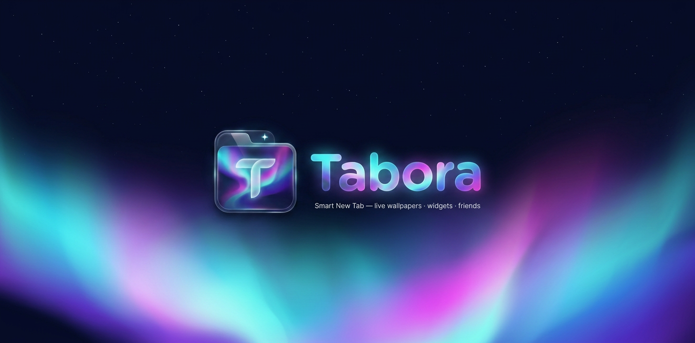

<p align="center">
  
</p>

<h1 align="center">💜 Tabora — Smart New Tab for Chrome</h1>

<p align="center">
  
  
  
  
</p>

<p align="center"><b>
  <a href="#-features--امکانات">Features</a> •
  <a href="#-install--نصب">Install</a> •
  <a href="#-backend">Backend</a> •
  <a href="https://github.com/Taboraex/tabora/releases">Releases</a>
</b></p>

<p align="center">
  A gorgeous, glassy new-tab experience: live wallpapers with a smart theme engine, living widgets, smart bookmarks, animated avatars, friends & full chat — in <b>فارسی & English</b>.
</p>
<p align="center" dir="rtl">
  نیوتب هوشمند و شیشه‌ای کروم: والپیپر متحرک با تم هوشمند، ویجت‌های زنده، بوکمارک هوشمند، آواتار متحرک، دوستان و چت کامل — دوزبانه.
</p>

---

## ✨ Features / امکانات

| | What it does | توضیح |
|---|---|---|
| 🏠 | Cinematic first-install welcome page with onboarding, language choice & cloud signup | صفحهٔ خوش‌آمدگویی نصب اول با ثبت‌نام ابری و کانفتی |
| ☁️ | Email/password auth — profile & settings live in Cloudflare and survive every update | تنظیمات در کلودفلر؛ با آپدیت اکستنشن هیچ‌چیز پاک نمی‌شود |
| 🎭 | Profile: name, username, bio + **71 animated avatars** (or upload / URL) | پروفایل کامل + ۷۱ آواتار متحرک یا آپلود دلخواه |
| 🖼️ | **12 built-in live wallpapers** + any video/image (URL or upload) and a **smart theme engine** that recolors the whole UI from your wallpaper | ۱۲ والپیپر زندهٔ داخلی + تم هوشمند |
| 👑 | Exclusive **Owner / Admin badges** next to every ID | بج اختصاصی مالک و مدیر |
| 🤝 | Friend requests + chat with **text, voice 🎙️, photos 🖼️, GIFs & stickers** | ادفرند و چت کامل |
| 🔖 | **Smart bookmarks** (up to 10): paste a link — Tabora detects the site, its name & logo | بوکمارک هوشمند با شناسایی خودکار سایت |
| 💱 | Live currency & gold prices **in Toman** (TGJU market data) | قیمت زندهٔ ارز و طلا به تومان |
| 🌤️ | Weather widget that **lives with the sky**: shining sun, falling rain, snow, lightning, fog | ویجت آب‌وهوای زنده |
| 🔍 | Search overlay: Google, Bing, DuckDuckGo, YouTube, Ecosia, Wikipedia + **live suggestions** | جستجوی چند‌موتوره با پیشنهاد زنده |
| ⚙️ | Settings: FA/EN, 5 fonts, widget size, toggle widgets, **drag to reorder** | تنظیمات کامل شخصی‌سازی |
| 🌐 | Fully bilingual — one click flips the whole UI between فارسی ↔ English | کاملاً دوزبانه |

## 🖼 Screenshots / تصاویر

<div align="center">
  
</div>

## 🚀 Install / نصب

1. Download `tabora-v1.0.0.zip` from the **[Releases](https://github.com/Taboraex/tabora/releases)** page and unzip it.
2. Open `chrome://extensions` and enable **Developer mode** (top-right).
3. Click **Load unpacked** and select the extracted folder.
4. Open a new tab — welcome to Tabora 🎉

<div dir="rtl">

زیپ را از بخش ریلیزها دانلود و اکسترکت کنید، در `chrome://extensions` حالت Developer mode را روشن کنید و با Load unpacked پوشهٔ اکسترکت‌شده را انتخاب کنید.

</div>

## 🗂 Project structure / ساختار

```
extension/             Chrome MV3 extension (new-tab override)
  manifest.json
  background.js        opens the welcome page on first install
  index.html           the new tab page
  welcome/             first-run onboarding experience
  js/                  app · api · i18n · store · wallpapers · widgets · search · social · panels
  css/app.css          glassmorphism design system
  assets/              logo · icons · 71 animated avatars
backend/               Cloudflare Worker REST API + D1 (SQLite)
  index.js             auth · profiles · friends · chat · prices proxy
  wrangler.toml
  schema.sql
docs/                  banner & images
build.sh               builds the release zip
```

## 🛠 Backend

The extension talks to a **Cloudflare Worker** (REST) backed by **D1**. Deploy your own:

```bash
cd backend
npx wrangler d1 create tabora                      # 1) create the database
# 2) copy the returned database_id into wrangler.toml
npx wrangler d1 execute tabora --file=schema.sql   # 3) create tables
npx wrangler deploy                                # 4) ship it
```

Then point `API_BASE` in `extension/js/api.js` and `welcome/index.html` to your Worker URL.

> 👑 The **first registered account automatically becomes Owner**.
> The Owner can promote/demote Admins right from the Friends panel.

### API overview

| Endpoint | Description |
|---|---|
| `POST /api/register` `/api/login` `/api/logout` | Auth (salted-hash passwords, 90-day sessions) |
| `GET/PATCH /api/me` | Profile, settings & bookmarks (cloud sync) |
| `GET /api/users?q=` | User search |
| `GET/POST /api/friends` `/api/friend/*` | Friend requests, accept/decline/remove |
| `GET/POST /api/messages` | Chat (text / image / voice / gif / sticker) |
| `GET /api/prices` | Currency & gold in Toman (cached) |

## 🔐 Security

- Passwords: salted + SHA-256. Sessions: 64-char random tokens.
- Basic rate limiting on register/login/friend requests.
- Never commit tokens — `.gitignore` has your back.

## 🛡 Protected builds

Releases ending in `-protected` ship **obfuscated JavaScript** (RC4 string encoding, control-flow flattening, hexadecimal identifiers) so the source is not human-readable:

```bash
./build-protected.sh 1.0.2     # builds tabora-v1.0.2-protected.zip
```

> ⚠️ Obfuscated builds are for direct distribution only — the **Chrome Web Store rejects obfuscated code**. Submit the clean `extension/` build there instead.

## 📄 License

[MIT](LICENSE) — do whatever makes you happy. Credit appreciated 💜

<p align="center"><sub>Made with ❤️ by the Tabora team</sub></p>
